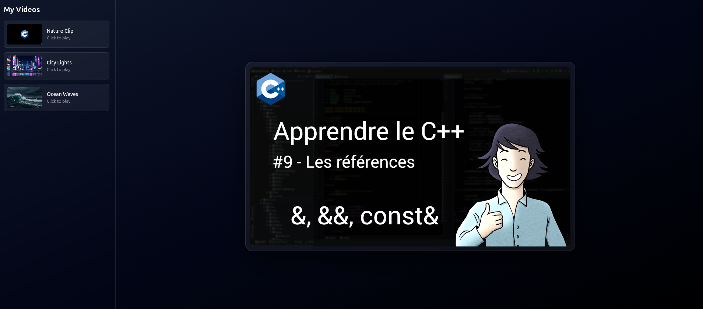

# 🎬 Mini Video Platform (Glassmorphism UI)

Une mini plateforme vidéo construite avec **HTML5, JavaScript vanilla et TailwindCSS**.

---

## 🚀 Demo

> (Ajoute ici ton lien GitHub Pages ou Vercel)

---

## 📸 Aperçu



---

## ✨ Fonctionnalités

- 🎥 Lecteur vidéo custom (HTML5 API)
- ▶️ Play / Pause interactif
- 🔊 Contrôle du volume + mute
- ⏱️ Barre de progression dynamique
- ⛶ Mode plein écran
- 🎞️ Playlist dynamique (sidebar)
- 🖼️ Thumbnails type Netflix
- 🎨 UI moderne glassmorphism dark
- 📱 Interface responsive

---

## 🧠 Concepts utilisés

- Manipulation du DOM (Vanilla JS)
- HTML5 Video API
- Event handling (play, timeupdate, input)
- UI/UX design moderne
- Glassmorphism design pattern
- Component-based structure (sans framework)

---

## 🛠️ Stack technique

- HTML5
- CSS3 (custom + glassmorphism)
- TailwindCSS
- JavaScript (ES6+)

---

## 📂 Structure du projet

video-platform/
│
├── index.html
├── css/
│ └── styles.css
├── js/
│ └── app.js
└── assets/
├── video.mp4
├── video2.mp4
├── video3.mp4
├── thumb1.jpg
├── thumb2.jpg
└── thumb3.jpg


---

## ⚙️ Installation

```bash
# clone le repo
git clone https://github.com/ton-username/video-platform.git

# ouvre le projet
cd video-platform

# lance avec Live Server ou open index.html
